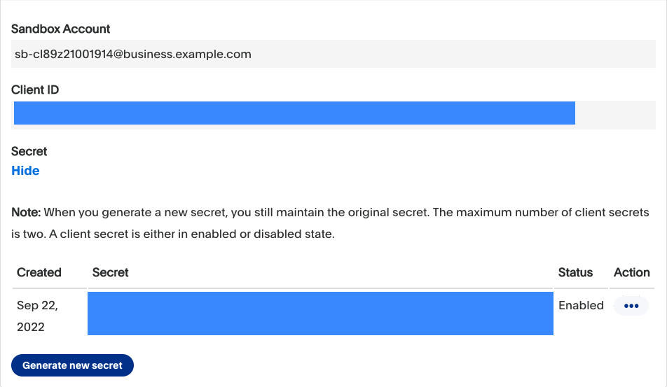

<div align="center">
  <a href="https://twitter.com/paypaldev" target="_blank">
    
  </a>
  <br />
  <a href="https://twitter.com/paypaldev" target="_blank">Twitter</a>
    <span>&nbsp;&nbsp;-&nbsp;&nbsp;</span>
  <a href="https://www.paypal.com/us/home" target="_blank">PayPal</a>
    <span>&nbsp;&nbsp;-&nbsp;&nbsp;</span>
  <a href="https://developer.paypal.com/home" target="_blank">Docs</a>
    <span>&nbsp;&nbsp;-&nbsp;&nbsp;</span>
  <a href="https://github.com/paypaldev" target="_blank">Code Samples</a>
    <span>&nbsp;&nbsp;-&nbsp;&nbsp;</span>
  <a href="https://dev.to/paypaldeveloper" target="_blank">Blog</a>
  <br />
  <hr />
</div>

# PayPal JAVA (Spring Boot) FullStack Standard Checkout
This sample app shows you how to integrate PayPal into your app for the [standard checkout(https://developer.paypal.com/docs/checkout/standard/integrate/) workflow.


## Public/index.html

### Create Order
The `createOrder()` callback allows you to create the request of your order with the following properties from the [V2 orders create call](https://developer.paypal.com/api/orders/v2/#orders-create-request-body): item_total, purchase_units, and more.

```javascript
    createOrder: function (data, actions) {
      return fetch("/api/orders", {
        method: "post",
      })
        .then((response) => response.json())
        .then((order) => order.id);
    },
```

### Approve Order
The `onApprove()` allows doing something with the order details after the order has been created. You can learn more about the [onApprove()](https://developer.paypal.com/sdk/js/reference/#link-onapprove) callback in your docs.

```javascript
onApprove: function (data, actions) {
      return fetch(`/api/orders/${data.orderID}/capture`, {
        method: "post",
      })
        .then((response) => response.json())
        .then((orderData) => {
          // Successful capture! For dev/demo purposes:
          console.log(
            "Capture result",
            orderData,
            JSON.stringify(orderData, null, 2)
          );
          const transaction = orderData.purchase_units[0].payments.captures[0];
          alert(`Transaction ${transaction.status}: ${transaction.id}

            See console for all available details
          `);
        });
    },
```

## PayPalController.java
This Java App was built using [Spring Boot](https://spring.io) the REST API.

### Create Order
The `createOrder()` is called on the `createOrder()`callback from the PayPal button to create an order. In this function, you can create the request of your order with the following properties from the [V2 orders create call](https://developer.paypal.com/api/orders/v2/#orders-create-request-body): item_total, purchase_units, and more.

Endpoint: `/api/orders`

```java
@RequestMapping(value="/api/orders", method = RequestMethod.POST)
@CrossOrigin
public Object createOrder() {
        String accessToken = generateAccessToken();
        RestTemplate restTemplate = new RestTemplate();

        HttpHeaders headers = new HttpHeaders();
        headers.set("Authorization", "Bearer " + accessToken);
        headers.add("Content-Type", "application/json");
        headers.add("Accept", "application/json");
        headers.setContentType(MediaType.APPLICATION_JSON);

        //JSON String
        String requestJson = "{\"intent\":\"CAPTURE\",\"purchase_units\":[{\"amount\":{\"currency_code\":\"USD\",\"value\":\"100.00\"}}]}";
        HttpEntity<String> entity = new HttpEntity<String>(requestJson, headers);

        ResponseEntity<Object> response = restTemplate.exchange(
                BASE + "/v2/checkout/orders",
                HttpMethod.POST,
                entity,
                Object.class
        );

        if (response.getStatusCode() == HttpStatus.CREATED) {
            LOGGER.log(Level.INFO, "ORDER CAPTURE");
            return response.getBody();
        } else {
            LOGGER.log(Level.INFO, "FAILED CAPTURING ORDER");
            return "Unavailable to get CAPTURE ORDER, STATUS CODE " + response.getStatusCode();
        }

    }
```

### Capture Payment
The `capturePayment()` function is called on the `onApprove()` callback from the PayPal button once an order has been completed. In this function, you can use the value returned to be stored in a database or to do something else with it.

Endpoint: `/api/orders/:orderID/capture`

```java
@RequestMapping(value="/api/orders/{orderId}/capture", method = RequestMethod.POST)
    @CrossOrigin
    public Object capturePayment(@PathVariable("orderId") String orderId) {
        String accessToken = generateAccessToken();
        HttpHeaders headers = new HttpHeaders();
        RestTemplate restTemplate = new RestTemplate();

        headers.set("Authorization", "Bearer " + accessToken);
        headers.add("Content-Type", "application/json");
        headers.add("Accept", "application/json");
        headers.setContentType(MediaType.APPLICATION_JSON);

        HttpEntity<String> entity = new HttpEntity<String>(null, headers);

        ResponseEntity<Object> response = restTemplate.exchange(
                BASE + "/v2/checkout/orders/" + orderId + "/capture",
                HttpMethod.POST,
                entity,
                Object.class
        );

        if (response.getStatusCode() == HttpStatus.CREATED) {
            LOGGER.log(Level.INFO, "ORDER CREATED");
            return response.getBody();
        } else {
            LOGGER.log(Level.INFO, "FAILED CREATING ORDER");
            return "Unavailable to get CREATE AN ORDER, STATUS CODE " + response.getStatusCode();
        }
    }
```

### Run this App

You will need to create a `.env` file with the following environment variables:

```shell
CLIENT_ID=
APP_SECRET=
```

Complete the steps in [Get started](https://developer.paypal.com/api/rest/) to get the following sandbox account information from the Developer Dashboard:
- Sandbox client ID and the secret of [a REST app](https://www.paypal.com/signin?returnUri=https%3A%2F%2Fdeveloper.paypal.com%2Fdeveloper%2Fapplications&_ga=1.252581760.841672670.1664266268).
- Access token to use the PayPal REST API server.



Run the following command to build the project with Maven:
`mvn clean install`

Now, run the following command in your terminal to start the server:

`./mvnw spring-boot:run `

and open the `http://localhost:8080/index.html` in your browswer.

## PayPal Developer Community
The PayPal Developer community helps you build your career while improving your products and the developer experience. You’ll be able to contribute code and documentation, meet new people and learn from the open-source community.
 
* Website: [developer.paypal.com](https://developer.paypal.com)
* Twitter: [@paypaldev](https://twitter.com/paypaldev)
* GitHub:  [@paypal](https://github.com/paypal)

